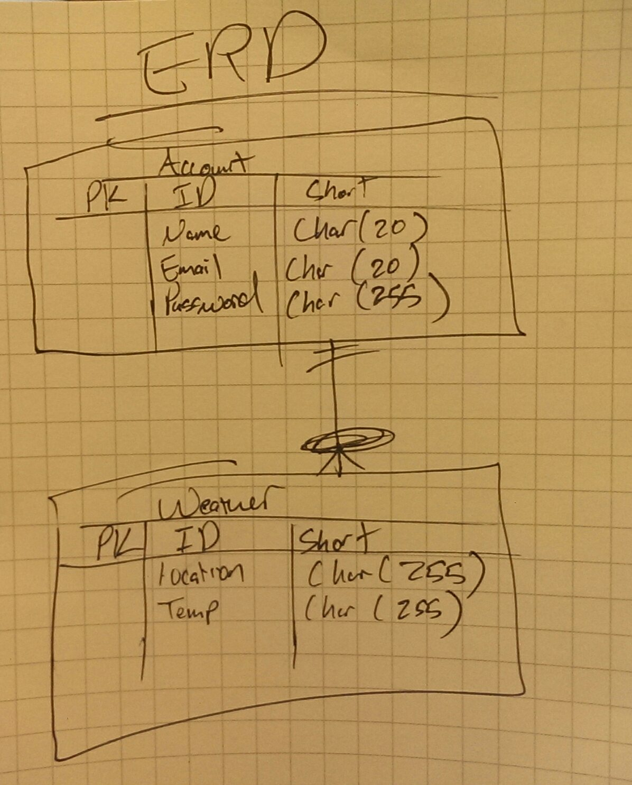
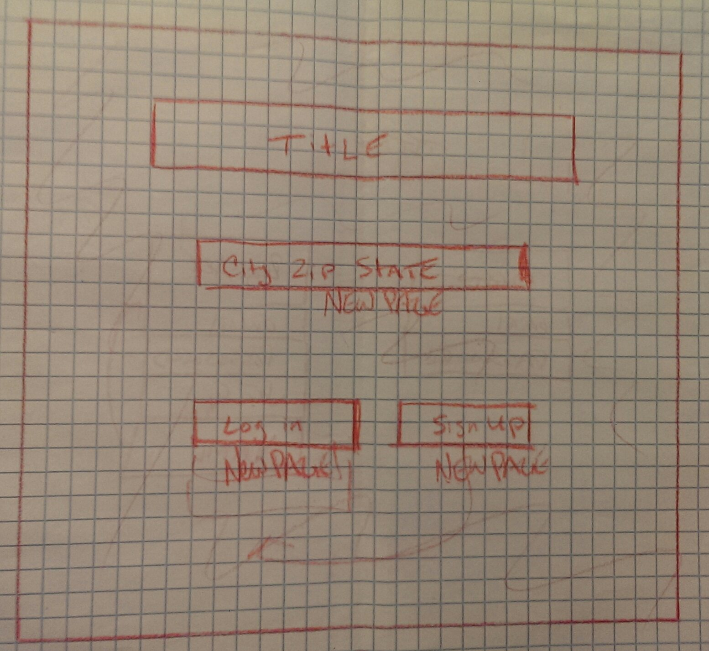
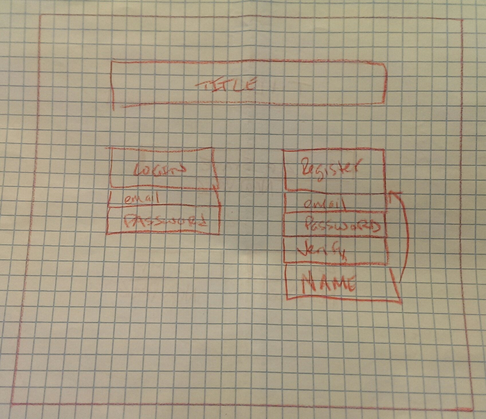
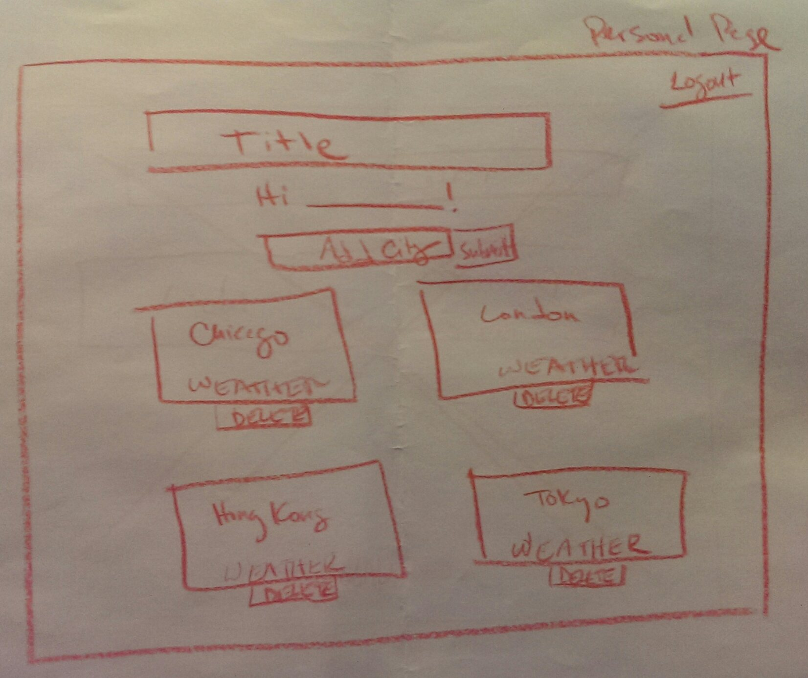

# WDI Project 2: Weather Buddy

## [Weather Buddy](https://weatherbuddy.herokuapp.com/)

### Objective:
- Make and application that allows users to log-in and follow the weather forecasts of multiple cities. This can be used by anybody who is interested in knowing the current and next day's forecast for a particular city.

### Technologies Used:
- Sinatra
- Sequel
- SQLite 3
- REST Client
- HTML 5
- CSS
- Ruby
- BCrypt
- Postgres

### Approach Taken:
- In order for the user to create, log-in and store their cities we used Sequel to input their information into the database.

- Each individual would have their own individual session through Sinatra.

- We used the Google Maps Geocoding API to retrieve the latitude and longitude of a location that was entered into the search box.

- Using that latitude and longitude, we then used Forecast.io's API to retrieve the forecast to display the user's entries.

### Wireframes

### Installation Instructions:
- No installation required.
- Application can be viewed on any browser via heroku.com.
- Linked provided above.

### Unsolved Problems/Not Enough Time:
- Logout button
- Navigation bar
- Styling how the forecast is displayed.
- The API call is displaying time-zone instead of city that was entered.
- On the landing page, we wanted to include a search box that allowed the user to search for a forecast without actually having to create an account.
